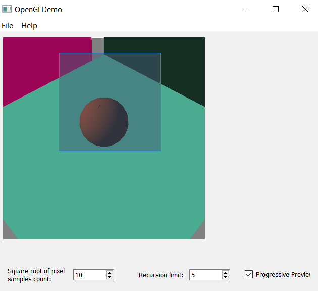
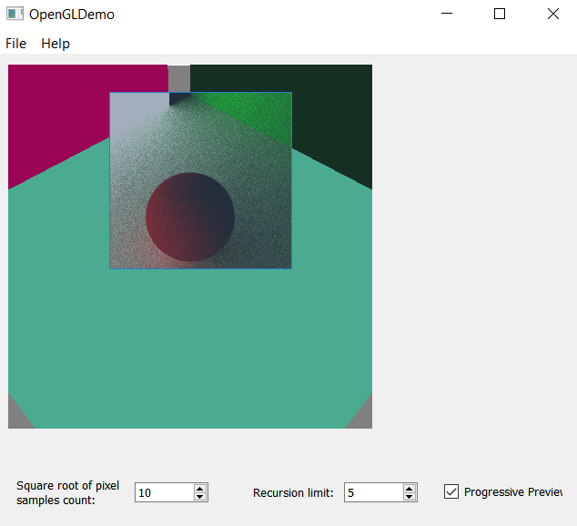
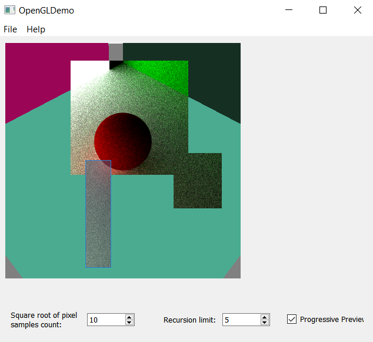

Path Tracer Episode II: Attack of the Rays
======================

**University of Pennsylvania, CIS 561: Advanced Computer Graphics, Homework 4**

Overview
------------
You will implement a na&#239;ve Monte Carlo path tracer by writing functions to
generate random ray samples within a hemisphere so that you can compute the
lighting a surface intersection receives. The images your path tracer produces
will be rather grainy in appearance, but in future assignments we will implement
ray sampling functions that will help combat this. For now, the most important
part of this assignment is reading through the base code and understanding how
all of the path tracer's components work together to produce an image.

Useful Reading
---------
Once again, you will find the textbook will be very helpful when implementing
this homework assignment. We recommend referring to the following chapters:
* 8.1: Basic Reflection Interface
* 8.3: Lambertian Reflection
* 9.1: BSDF
* 9.2: Material and Interface Implementations
* 5.4: Radiometry

The Light Transport Equation
--------------
#### Lo(p, &#969;o) = Le(p, &#969;o) + &#8747;S f(p, &#969;o, &#969;i) Li(p, &#969;i) V(p', p) |dot(&#969;i, N)| _d_&#969;i

* __Lo__ is the light that exits point _p_ along ray &#969;o.
* __Le__ is the light inherently emitted by the surface at point _p_
along ray &#969;o.
* __&#8747;S__ is the integral over the sphere of ray
directions from which light can reach point _p_. &#969;o and
&#969;i are within this domain. In general, we tend to only care
about one half of this sphere, determining the relevant half based on the
reflectance or transmittance of the BSDF.
* __f__ is the Bidirectional Scattering Distribution Function of the material at
point _p_, which evaluates the proportion of energy received from
&#969;i at point _p_ that is reflected along &#969;o.
* __Li__ is the light energy that reaches point _p_ from the ray
&#969;i. This is the recursive term of the LTE.
* __V__ is a simple visibility test that determines if the surface point _p_' from
which &#969;i originates is visible to _p_. It returns 1 if there is
no obstruction, and 0 is there is something between _p_ and _p_'. This is really
only included in the LTE when one generates &#969;i by randomly
choosing a point of origin in the scene rather than generating a ray and finding
its intersection with the scene.
* The __absolute-value dot product__ term accounts for Lambert's Law of Cosines.

Code Style Notes
-------------
Many of the functions with which we have provided you "return" multiple values
by way of altering variables that are function inputs. For consistency, we only
use references to save stack space when passing variables into functions; they
are always `const`. On the other hand, if a function contains a pointer to some
variable, then the function is expected to alter the value of the variable
passed by pointer, assuming the pointer is not `null`.

We have also defined several type aliases in `globals.h` to make the provided
code more human-readable. For example, rather than declaring `glm::vec3`s to
represent points, directions, and normals all together, we have provided the
`Point3f`, `Vector3f`, and `Normal3f` types to use in your code. When compiled,
they simply become `glm::vec3`s, and can be used exactly the same way, but they
make the code a little easier to interpret for a human. There are additional
types defined in `globals.h` along with some utility functions and constant
float values (e.g. &#960; / 2), so we highly recommend you look at this file
before writing any code.

`WarpFunctions` Implementations
------------
Copy your implementation of `warpfunctions.cpp` into the base code we've
provided. You may have to change some of the constants you used in homework 3,
such as `M_PI` to `Pi`. Refer to `globals.h` for more information.

`Shape::ComputeTBN` (5 points)
----------------
We have provided you with implementations of the function `Shape::Intersect`,
which computes the intersection of a ray with some surface, such as a sphere or
square plane. Each of the classes that inherits from `Shape` invokes
`ComputeTBN`, a function that computes the world-space geometric surface normal,
tangent, and bitangent at the given point of intersection. However, in the code
we have provided, this function only computes the world-space geometric surface
normal. For every `ComputeTBN`, you must add code that computes the world-space
tangent and bitangent. Note that unlike transforming a surface normal,
transforming a tangent vector from object space into world space __does not__
use the inverse transpose of the object's model matrix, but rather just its
model matrix. If you consider transforming any plane from one space to another
space, you can see that any vector within the plane (i.e. a tangent vector)
must be transformed by the matrix used to transform the whole plane.

You might be wondering why these additional vectors are needed in the first
place; it's because we'll need them to create matrices that transform the rays
&#969;o and &#969;i from world space into tangent space
and back when evaluating BSDFs. By tangent space, we mean a coordinate system
in which the surface normal at the point of intersection is treated as (0, 0, 1)
and a tangent and bitangent at the intersection are treated as (1, 0, 0) and
(0, 1, 0) respectively. These matrices are analogous to the orientation
component of a camera's View matrix and its inverse.

`Primitive` Class
-------------
The path tracer base code uses a class called `Primitive` to encapsulate
geometry attributes such as shape, material, and light source. `Primitives` can
intersect with rays, and they can generate `BSDF`s for `Intersection`s based
on the `Material` attached to the `Primitive`. They can also return the light
emitted by the `AreaLight` attached to them, if one exists. `Primitives` hold
the following data:
* A pointer to a `Shape` describing the geometric surface of this `Primitive`
* A pointer to a `Material` describing the light scattering properties of this
`Primitive`
* A pointer to an `AreaLight` describing the energy emitted by the surface
of the `Shape` held by this `Primitive`.

`BSDF` Class (30 points)
----------
In `scene/materials/bsdf.h`, you will find the declaration of a `BSDF` class.
This class represents a generic Bidirectional Scattering Distribution Function,
and is designed to hold a collection of several `BxDF`s, which represent
specific scattering functions. For example, a Lambertian BRDF or a Specular
Transmission BTDF would be defined by classes that inherit from BxDF. When a
BSDF is asked to evaluate itself (i.e. invoke the `f` component of the Light
Transport Equation), it evaluates the `f` of all the BxDFs it contains. You
must implement the following functions for the `BxDF` class:
* `f(const Vector3f &woW, const Vector3f &wiW, BxDFType flags)`
* `Sample_f(const Vector3f &woW, Vector3f *wiW, const Point2f &xi,
  float *pdf, BxDFType type, BxDFType *sampledType)`
* `Pdf(const Vector3f &woW, const Vector3f &wiW, BxDFType flags)`
* The portion of the `BSDF` constructor's initialization list that instantiates
its `worldToTangent` and `tangentToWorld` matrices, which are composed of the
input `Intersection`'s `tangent`, `bitangent`, and `normalGeometric`. The
`worldToTangent` matrix has these vectors as its rows, and the `tangentToWorld`
has them as its columns (in the order listed, so it would be tangent, then
  bitangent, then normal). Remember that the constructor for a GLM matrix uses
  the input vectors as the columns of the resultant matrix.

We have provided comments above each of these functions in `bsdf.h` which
describe what these functions are supposed to do. Please make sure you read
these comments carefully before you begin implementing these functions.

`BxDF` Class (15 points)
-------------
You will find the declaration of the `BxDF` class in `scene/materials/bsdf.h`.
As explained previously, `BxDF` is an abstract class used to evaluate the
result of a specific kind of BSDF, such as Lambertian reflection or specular
transmission. You must implement the `Sample_f` and `Pdf` functions of this
class so that the former randomly generates a ray direction `wi` from a uniform
distribution within the hemisphere and that the latter computes the PDF of this
distribution. Note that `Sample_f` also returns the result of invoking `f` on
the input `wo` and the generated `wi`, but `f` will be defined by specific
subclasses of `BxDF`.

`LambertBRDF` Class (15 points)
--------
In `scene/materials/lambertbrdf.h` you will find the declaration of a class
`LambertBRDF`, which will be used to evaluate the scattering of energy by
perfectly Lambertian surfaces. For this class, you must implement the `f`,
`Sample_f`, and `Pdf` functions. Unlike the generic `BxDF` class, the
`LambertBRDF` class will generate cosine-weighted samples within the hemisphere
in its `Sample_f` and will return the PDF associated with this distribution in
`Pdf`. Most importantly, `f` must return the proportion of energy from `wi` that
is reflected along `wo` for a Lambertian surface. This proportion will include
the energy scattering coefficient of the BRDF, `R`.

`MatteMaterial` Class
---------
We have provided one class that inherits from the abstrace base class
`Material`, `MatteMaterial`. This class describes a material with diffuse
reflectance properties similar to those of, say, matte paint. This class
implements a function called `ProduceBSDF`, which is invoked via the `Primitive`
class during its `Intersect` function to assign a `BSDF` to the `Intersection`
generated by this `Intersect` function. `ProduceBSDF` looks at the texture and
normal maps of the `MatteMaterial` and combines them with the base reflectance
color and `sigma` term of the material to produce either an Oren-Nayar BRDF
(for extra credit if you choose) or a Lambertian BRDF, as described above.

`Integrator` Class
------------
We have provided you with the abstract class `Integrator` in
`integrators/integrator.h`. This class is analogous to the `RenderTask` class
you wrote for your ray tracer. It has a function `Render` which iterates
over all of the pixels in this `Integrator`'s image tile and generates a
collection of samples within a pixel, then ray casts through each and evaluates
the energy that is emitted from the scene back to the camera's pixel. This
function invokes another function `Li` to evaluate this energy, but the base
`Integrator` class provides no implementation.

`NaiveIntegrator` class (25 points)
------------
You will implement the body of the `NaiveIntegrator` class's `Li` function,
which recursively evaluates the energy emitted from the scene along some ray
back to the camera. This function must find the intersection of the input ray
with the scene and evaluate the result of the light transport equation at the
point of intersection. Below is a list of functions you will find useful while
implementing `Li`:
* `Scene::Intersect`
* `Intersection::Le`
* `Intersection::ProduceBSDF`
* `Intersection::SpawnRay`
* `BSDF::Sample_f`

Note that if `Li` is invoked with a depth value of 0 or if the intersection with
the scene hits an object with no `Material` attached, then `Li` should only
evaluate and return the light emitted directly from the intersection.

`DiffuseAreaLight` Class (10 points)
-----------
You will find this class under `scene/lights/diffusearealight.h`, and it
represents an area light that emits its energy equally in all directions from
its surface. For this class, you must implement one function, `L`, which returns
the light emitted from a point on the light's surface along a direction `w`,
which is leaving the surface. This function is invoked in `Intersection::Le`,
which returns the light emitted by a point of intersection on a surface.

OpenGL Preview Window
-----
As with your ray tracer, we have provided you with an OpenGL preview window.
Unlike with the ray tracer, the colors assigned to objects in this preview are
not correlated with their material colors, due to the way `Material`s are
designed in the path tracer. Every time you preview a scene, its shapes will
be colored randomly.

Example Renders
---------
When you ask your program to render an image, it may slow down the other
processes of your computer since Qt will try to use all available CPU cores.
The program will play a short jingle when it has completed a render so you can
go browse Facebook or read internet news articles (or maybe even the textbook!?)
while you wait. Expect the renders to take much longer than those of your ray
tracer, seeing as you are evaluating hundreds of rays per pixel rather than just
one.

You may click and drag on the GL preview screen to select a portion of it to
render, rather than rendering the entire image.

We recommend first testing your implementation of `IntegratorL:Li` with only a
single ray recursion; this effectively computes only the direct lighting that
each visible point in the scene reflects back to the camera. You can alter the
number of ray recursions by adjusting the input to `Li`, which is invoked in
`Integrator::Render`. If you render the provided scene with one recursion, 100
samples per pixel (the default value), and cosine-weighted sampling, you should
receive the following render (note that there is a pale yellow light just
offscreen to the left):

If you increase your recursion depth limit to 5, you should see the effects of
global illumination: light bouncing off surfaces onto other surfaces to add some
additional color, as light does in reality. You should produce this render:

Progressive rendering and render region
---------------------------------------
We also have added functionality to progressively render scenes based on the regions you select. By default, if you hit render, you would see the OpenGL preview change to the render of the scene.

The preview scene will show up if you move your camera and then set it to render.

The render region works with the progressive renderer, similar to what exists in Maya.

Click and drag region in the GL preview and hit render.

Debugging with breakpoints
------
We have set comments in the base code showing where you can _uncomment_ some
code to more easily debug your program using breakpoints. First, you will have
to disable multithreaded rendering of your scene by commenting out a `#define`
in `MyGL::RenderScene`, and if you wish to debug specific pixels you will have
to uncomment some example code in `MyGL::RenderScene` and `Integrator::Render`.

Extra credit (30 points maximum)
-----------
In addition to the features listed below, you may choose to implement __any
feature you can think of__ as extra credit, provided you propose the idea to the
course staff through Piazza first.

#### Oren-Nayar BRDF (5 points)
Implement a class `OrenNayarBRDF` which inherits from the `BxDF` class and
implements Oren-Nayar diffuse reflection as described in the textbook. You will
also have to add code to `MatteMaterial::ProduceBSDF` so that it adds this
`BxDF` to the `BSDF` it generates when the material's `sigma` term is greater
than zero. To test your implementation, modify the code in
`Scene::CreateTestScene` so that the `sigma` value of at least one of the
`MatteMaterial`s is nonzero. You will just need to implement this BRDF's `f`
function, since its `Sample_f` and `Pdf` are identical to those of the
`LambertBRDF` class.

#### Lambertian Transmission BTDF (5 points)
Implement a class `LambertBTDF` which inherits from the `BxDF` class and
implements a Lambertian __transmission__ model. This is virtually identical to
a Lambertian reflection model, but the hemisphere in which rays are sampled is
on the other side of the surface normal compared to the hemisphere of Lambertian
reflection.

Submitting your project
--------------
Along with your project code, make sure that you fill out this `README.md` file
with your name and PennKey, along with your test renders. You should include
renders using uniform hemisphere sampling, cosine weighted hemisphere sampling,
one recursion, and five recursions. If you have time, you should try rendering
your image using thousands of samples per pixel rather than hundreds so that you
have an image result that is much smoother in appearance.

Rather than uploading a zip file to Canvas, you will simply submit a link to
the committed version of your code you wish us to grade. If you click on the
__Commits__ tab of your repository on Github, you will be brought to a list of
commits you've made. Simply click on the one you wish for us to grade, then copy
and paste the URL of the page into the Canvas submission form.
